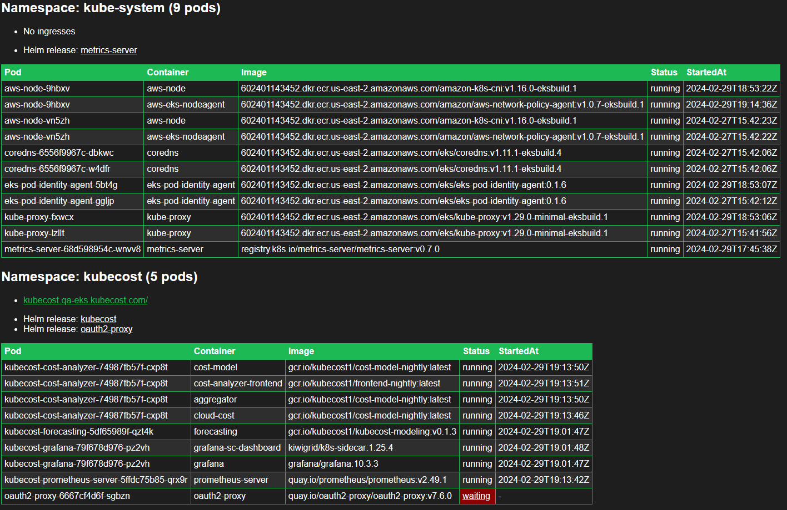

# e10s - A Kubernetes tool to list (dev/test/qa/etc) environments

Simple tool to display reasonably-detailed information about the resources in a cluster.

Why was this made?

1. Easy to use: No need to type commands, just find the environment you need through a simple interface.
2. Web UI with read-only cluster-wide visibility.

TODO:

1. Add a search/filters to the UI
2. Watch ingresses and helm resources instead of a cronJob?
3. Multi-cluster (with mongodb?)
4. Self-update option
5. Recommend fixes for non-running pods (using AI?)
6. Fix tooltip display
7. Error handling
8. Collapse pod table by default if no errors
9. Option to show CPU/memory/storage usage

Alternatives to consider:

1. <https://headlamp.dev/docs/latest/installation/>
2. <https://k9scli.io/topics/install/>

Shout out to all the AI tools for writing a majority of this. The CSS was generated by copilot with the request for dark mode in the style of Kubecost.

Sample output:
<https://htmlpreview.github.io/?https://github.com/jessegoodier/e10s/blob/main/docs/index.html>

Screenshot:


## Security Considerations

This will expose every ingress in your cluster.  Please consider the security implications of this.

See the [oauth2 readme](auth/oauth2-proxy/README.md) as an example of how to secure this.

The service is exposed by an unprivileged (no service account and non-root) nginx web server. The nginx web server can be easily replaced by any http server.

The cronJob that creates the html configMap has a serviceAccount with cluster-wide privileges to read the required resources and `reload restart` the web deployment.

If you remove the helm list function, RBAC get secrets is not needed.

## Usage

Clone this repo:

```sh
git clone git@github.com:jessegoodier/e10s.git
```

Edit the manifests to fit your needs.
Then:

```sh
kubectl create ns e10s
kubectl create configmap get-environments --from-file get_environments.py -n e10s
kubectl create configmap css --from-file docs/css/styles.css -n e10s
kubectl apply -f ./manifests -n e10s
```

Expose the website:

```sh
kubectl port-forward -n e10s svc/e10s 8080
```

You'll likely want to expose the service with a protected ingress. An example of that is provided in [oauth2 readme](auth/oauth2-proxy/README.md).

* Note that the ne10s-web will have a status of `ContainerCreating` until the cronjob runs and creates the html configMap. This job runs every 13 minutes and can be configured in the [cronjob manifest](manifests/e10s-kubernetes-cronjob.yaml).

### One-off run/testing

A pod manifest is included for one-off runs of the python script. This is useful for debugging or if you don't want to wait for the cronjob to run.

```sh
kubectl create configmap css --from-file docs/css/styles.css -n e10s
kubectl create configmap get-environments --from-file get_environments.py -n e10s
kubectl apply -f ./manifests/rbac.yaml -n e10s
kubectl apply -f testing/test-script-runner-deployment.yaml -n e10s
```

### Dockerfile

The Dockerfile is maintained here: <https://github.com/alpine-docker/k8s>
# e10s
